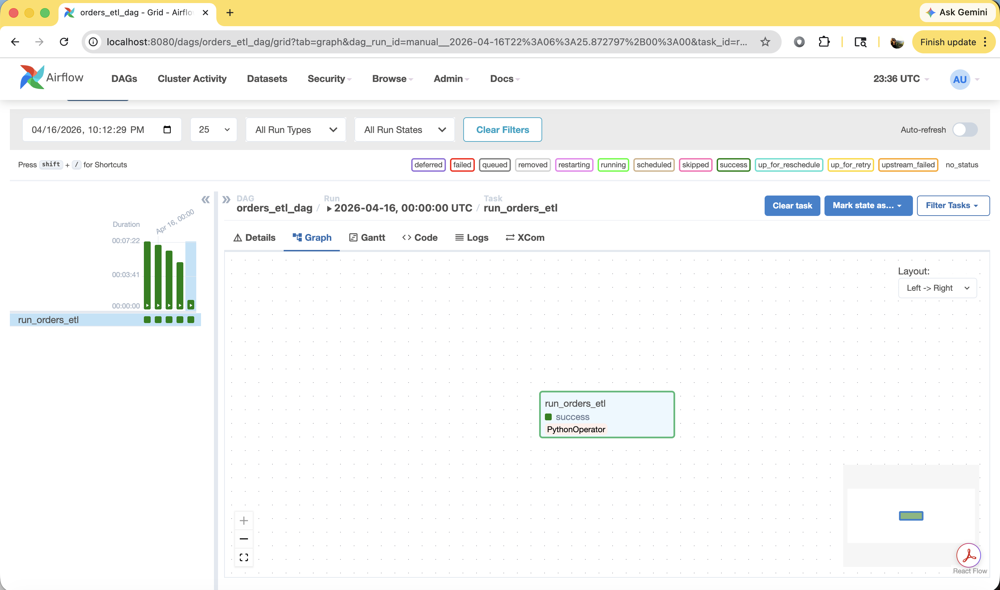
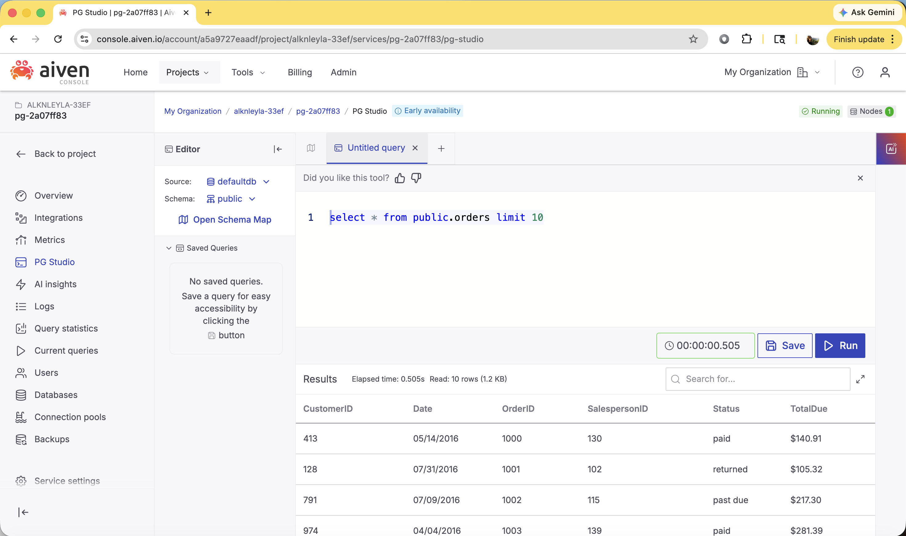

# Orders ETL Pipeline with Apache Airflow

An end-to-end ETL pipeline that extracts order data from Excel, transforms it, and loads it into a cloud PostgreSQL database on a daily schedule using Apache Airflow.

---

## Overview

The pipeline reads from a local Excel source, selects the relevant fields (OrderID, Date, TotalDue, Status, CustomerID, SalespersonID) and loads them into a PostgreSQL instance on Aiven Cloud. Airflow handles orchestration, scheduling and retry logic, with full visibility into run history and task status through the web UI.

---

## Tech Stack

Stack
Python, Pandas, SQLAlchemy, Apache Airflow, PostgreSQL (Aiven Cloud)

---

## Project Structure

```
airflow/
└── dags/
    ├── orders_dag.py          # DAG definition and schedule configuration
    └── orders_etl_logic.py    # ETL logic (extract, transform, load)
```
Keeping the ETL logic decoupled from the DAG definition makes the pipeline easier to test and maintain independently.

---

## How it works
The DAG runs on a daily schedule. When triggered, Airflow calls the `main()` function in `orders_etl_logic.py` through a `PythonOperator`. That function reads the Excel file using Pandas, selects the relevant columns, and writes the result to a PostgreSQL table using SQLAlchemy. If the task fails, Airflow automatically retries once after 5 minutes.

The pipeline runs against a private data source and database so it isn't reproducible as-is, but the structure is straightforward to adapt to any Excel source and PostgreSQL connection.

---

### Dependency versions

The versions in `requirements.txt` are intentionally pinned. Pandas 2.x introduced a breaking change where to_sql no longer accepts a SQLAlchemy Engine directly and requires a Connection object. Combined with SQLAlchemy 2.x also dropping legacy DBAPI cursor support, the safest combination on Python 3.10 is numpy 1.23.5, pandas 1.5.3 and sqlalchemy 1.4.46.

---

## Debugging

When a task fails, Airflow marks it as `up_for_retry` rather than showing the error inline. The actual traceback is in the task logs, accessible by clicking the task in the UI. That's where the SQLAlchemy compatibility issue surfaced, which wouldn't have been obvious from the status alone.

---

## Pipeline in action

Airflow DAG completing successfully:



Query results in Aiven PG Studio confirming the data loaded:



---

## What this covers

Pipeline orchestration with Airflow, separating ETL logic from DAG definitions, dependency version management, and debugging task failures through Airflow's logging system.
